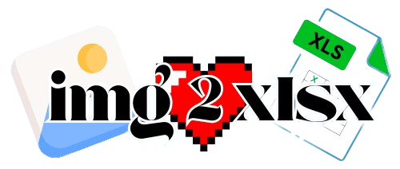

# Img2Xlsx v1.1.0

  

  <strong>Transform your images into vibrant Excel art!</strong>

---

## Table of Contents

* [Project Overview](#project-overview)
* [Logic and Theory](#logic-and-theory)
* [Usage](#usage)
* [Notes](#notes)
* [License](#license)

## Project Overview

**Img2Xlsx** is a web app that converts images (PNG, JPG, JPEG, BMP) into Excel spreadsheets. Each pixel becomes a cell colored to match, creating a pixel-art effect.

**Key Features**:

* Grid sizes: 25×25, 50×50, 100×100, or "Free Size"
* Real-time image processing and Excel generation
* Clean, user-friendly interface

---

## Logic and Theory

### 1. Image Processing with Pillow

* **Conversion to RGB** using `Image.open`
* **Resizing**:

  * Fixed grids use `Image.resize` with `LANCZOS` filter
  * Free size uses `get_scaled_dimensions` to maintain aspect ratio

### 2. Pixel Data Extraction with NumPy

* Image converted to array using `np.array(img)`
* RGB values accessed as `img_array[row, col]`

### 3. Excel Generation with Openpyxl

* Workbook titled `ImageArt`
* Cells styled:

  * Column width = 2
  * Row height = 12
* RGB → Hex color → `PatternFill`

### 4. File Handling

* Uses `secure_filename` from Werkzeug
* Temp files auto-cleaned from `/tmp/uploads` and `/tmp/outputs`

### 5. Flask Backend

* `/` route handles both GET (UI) and POST (conversion)
* Error handling and user feedback included

---

## Usage

1. **Upload**: Select an image file (PNG, JPG, JPEG, BMP)
2. **Choose Grid**: 25x25, 50x50, 100x100, or Free Size
3. **Convert**: Click **Convert to Excel**
4. **Download**: Open the `.xlsx` file to view pixel art

---

## Note

**I have used Code Sandbox for the initial development before transferring it to github so the previous commits are not visible here.**

---

## License

This project is licensed under the **MIT License**.
See the [LICENSE](LICENSE) file for details.

> Created by **Lucifer | 2025**
